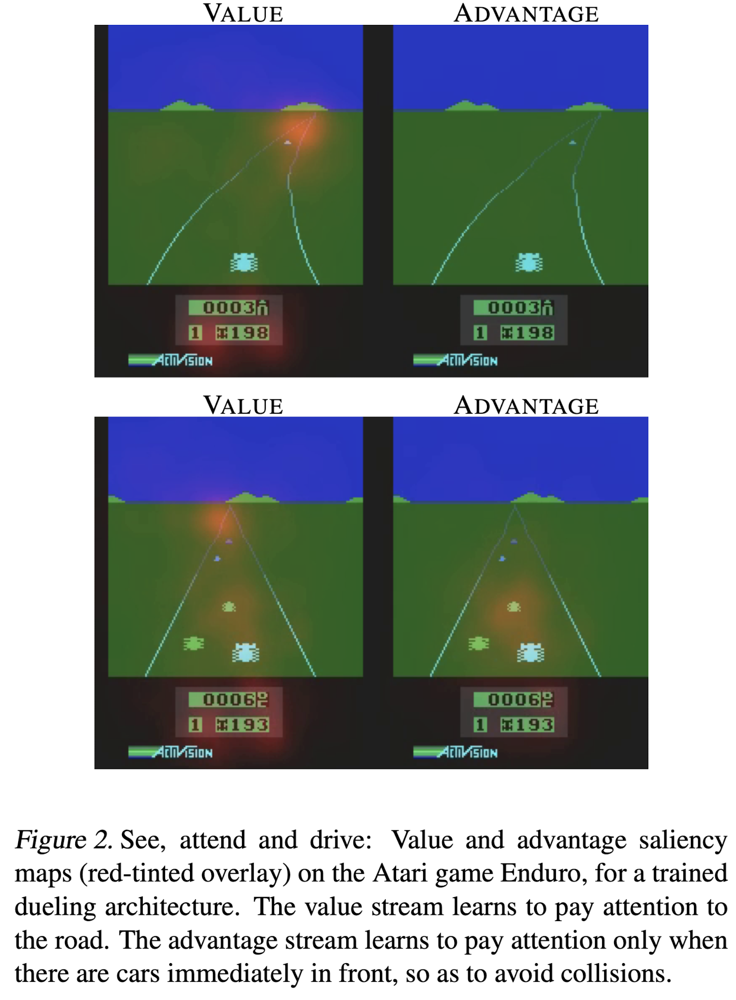
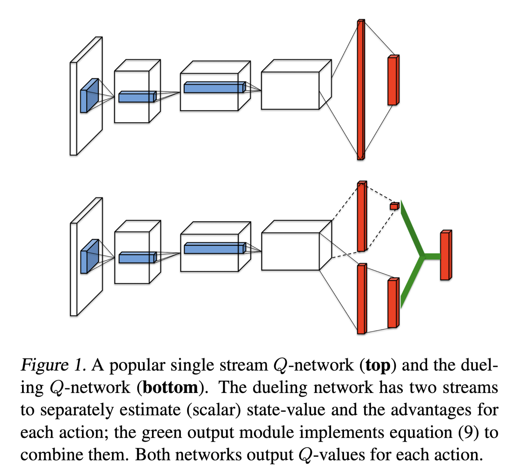
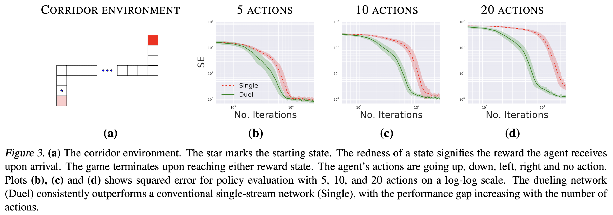

+++
date = '2025-03-24T14:38:49+09:00'
draft = false
title = 'Double DQN'
+++

# Introduction

This image represents the point from which authors got key insight.
- In some states, there is no important to which action is taken.
- But in other states, where a collision is imminent, which action should be taken becomes very important.

# Methods
Behind this key insight, authors present adopted advantage function.
- The objective of DQN algorithm is learning Q action value function.
- While DDQN try to make both V state value function and A advantage function, where
$$ 
\begin{gathered}
Q^\pi (s,a) = \mathbb{E} [R_t | s_t = s, a_t = a, \pi] \\\
V^\pi (s) = \mathbb{E}_{a \sim \pi(s)} [Q^\pi (s,a)] \\\
A^\pi (s, a) = Q^\pi (s,a) - V^\pi (s)
\end{gathered}
$$
- Note that $\mathbb{E} [A^\pi (s,a)] = 0$
- Let me denote advantage as $A(s,a;\theta, \alpha)$ and value function as $V(s,a;\theta,\beta)$ for convenience.
  - $\theta$ is shared parameter in CNN network for learning atari.

The image above represents simple architecture of DDQN.
- In the diagram, model architecture at the top is that of DQN and the one at the bottom is DDQN.
- From the model architecture below, we can see that DDQN learns the value function V and the advantage function A separately.

## Loss functions
In Both DQN and DDQN, training is processed to reduce loss shown below

$$ L_i(\theta_i) = \mathbb{E}_{s, a, r, s^\prime} \[(y_i - Q(s,a,; \theta_i))^2\] $$

- In DQN, $y_i$ becomes
$$ y_i^{DQN} = r + \gamma \max_{a^\prime} Q(s^\prime, a^\prime; \theta^-) $$
- And in DDQN, $y_i$ becoms
$$ y_i^{DDQN} = r+ \gamma Q(s^\prime, \arg \max_{a^\prime} Q(s^\prime, a^\prime; \theta_i); \theta^-) $$
  - It has been pointed out that using the $\max$ operator in DQN can lead to an **overoptimistic value estimates** of the Q-function.
  - To address this issue, DDQN adopts the $\arg \max$ operator to mitigate the overestimation bias.

DDQN algorithm is the same as DQN, except for the difference in model architecture and loss term between $y_i^{DDQN}$ and $y_i^{DQN}$.

## Calculating target in DDQN
In DDQN, CNN network produces two stream, value function $V(s)$ and advantage $A(s)$.
One naive approach to obtain Q value is simply
$$ Q^\pi (s,a; \theta, \alpha, \beta) = V^\pi (s,a;\theta, \beta) + A^\pi (s,a; \theta, \alpha)$$
- Note that dimension of output $V^\pi (s,a; \theta, \beta)$ is $1$ and $A^\pi(s,a;\theta,\alpha)$ is $|\mathcal{A}|$.
  - where $|\mathcal{A}|$ is the number of actions in each environment.

But this equation has a crucial defect: $V^\pi$ and $A^\pi$ are **not uniquely determined**.
- Suppose we shift the value function as $V^\pi \gets V^\pi + C$,  where $C$ is an arbitrary constant, and adjust the advantage function as $A^\pi \gets A^\pi - C$.
- Then in the equation $Q^\pi (s,a) = (V^\pi (s) + C) + (A^\pi (s,a) - C) = V^\pi (s) + A^\pi (s,a)$, the constant $C$ cancels out.
- This example shows that directly using above equation holds true even if $V^\pi(s)$ can become $V^\pi(s) + C$ for arbitrary constant $C$ with correspondingly determined $V^\pi (s,a) -C$.
Authors says that this lack of identifiability is mirrored by poor practical performance.

There are two different modified equation

### First version

$$ Q(s,a; \theta, \alpha, \beta) = V(s; \theta, \beta) + \(A(s,a; \theta, \alpha) - \max_{a^\prime \in \mathcal{|A|}} A(s, a^\prime; \theta, \alpha)\)$$

This equation makes Advantage term as zero when action that makes $A(s,a)$ max is selected because
$$
 \begin{gathered}
   \text{for } a^* := \arg \max_{a^\prime \in \mathcal{A}} Q(s, a^\prime; \theta, \beta) = \arg \max_{a^\prime \in \mathcal{A}} A(s,a^\prime;\theta,\alpha), \\\
   Q(s,a^*;\theta,\alpha,\beta) = V(s; \theta, \beta)
 \end{gathered}
$$

### Second version

$$
\begin{equation}
Q(s,a;\theta, \alpha, \beta) = V(s;\theta, \beta) + \( A(s, a;\theta, \alpha) - \frac{1}{|\mathcal{A}|}\sum_{a^\prime}A(s,a^\prime;\theta,\alpha) \)
\end{equation}
$$

Authors found that second version of equation increases the stability of optimization rather than the first version.

# Experiments

## Corridor

__Corridor__ is designed as simple environment in which true $Q$ value function can easily be calculated.
In above graph, SE(squared error) is calculated as $$\sum_{s \in \mathcal{S}, a \in \mathcal{A}} (Q(s,a; \theta)- Q^\pi(s,a))^2$$

In the plots, red dotted line represents SE values of simple DQN network (single) whereas green line represents SE values of simple DDQN network.
Network architecture of DQN network and DDQN network in this __corridor__ environment is shown below.
- Single network, is consist of 3 layer simple MLP and in each hidden layer 50 units exists, is trained by DQN algorithm
- Duel network, is consist of 1 layer MLP with 50 hidden units and then branches off into two streams each of them a two layer MLP with 25 hidden units.
  
Plots indicates that the dueling architecture shows higher performance than the single stream architecture as the number of no-op actions increases.
- This can be explained by the fact that the duel architecture allows the network to better capture the role of each action.

