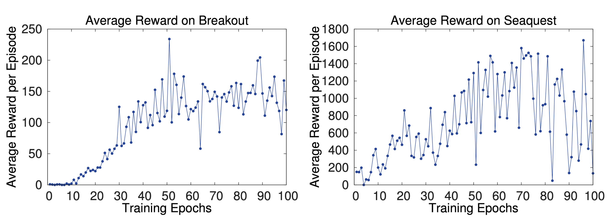
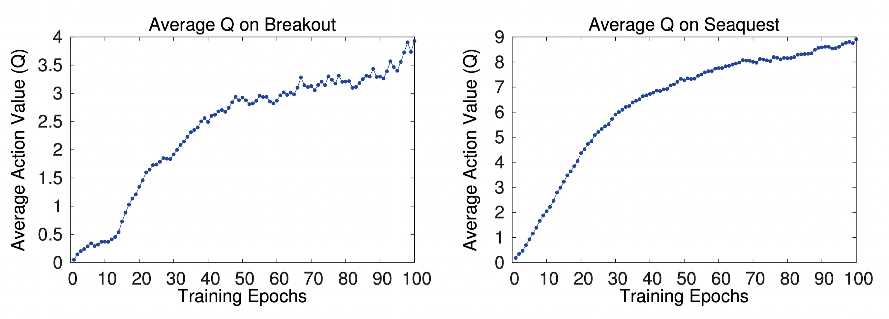

+++
date = '2025-03-14T14:28:57+09:00'
draft = false
title = 'DQN'
params.math = true
# bibliography = "data/citations/bibilography.bib"
+++

In this paper[@mnih2013playing], atari game is solved with combination of CNN network and Q-Learning algorithm.

# Q Learning
Before talking about DQN, first see about Q-Learning.

The objective of Q-Learning is to find optimal action-state 
$$ Q^\ast (s,a) = \max_{\pi} \mathbb{E}_{\pi}[r\mid s, a] $$

And in each step, learned agent selects greedy based on its learned action value function. 
In other words, in state $s \in \mathcal{S}$, agent select action 
$$a = \arg\max_{a^\prime \in \mathcal{A}(s)}Q(s, a^\prime) $$

Agent behaviors by greedy policy for well trained action value function $ Q(s,a) $ in model-free environment.

# Deep Q Learning
In Deep Q learning, parametrized action value function $ Q(s, a) $ as neural network is trained. It is denoted by $Q_\theta (s, a)$. By applying bellman equation $$\mathbb{E}[r + \gamma \max_{a^\prime \in \mathcal{A}} Q^\ast (s^\prime, a^\prime ) \mid s ,a] = Q^\ast (s,a)$$ as an iterative update $$ Q_{i+1} \gets \mathbb{E}[r + \gamma \max_{a^\prime \in \mathcal{A}} Q_{i}(s^\prime,a^\prime )\mid s,a] $$ this approximates for optimal action value function \\( Q^\ast(s,a) \\)  \\( \(Q_i \rightarrow Q^\ast \\) ,as  \\( i \rightarrow \infty\) \\) .

The Q-network is referred to as a neural network function approximator with weights $\theta$ ($Q_\theta (s,a) \approx Q(s,a)$)
Then loss function for each iteration can be written by
$$ 
\begin{gathered}
L_i (\theta\_i) = \mathbb{E}_{s,a \sim \rho(\cdot)} \[(y\_i - Q(s,a ;\theta))^2\] \\\
y_i = \mathbb{E}\_{s^\prime \sim \mathcal{S}} [r + \gamma \max\_{a^\prime} Q(s^\prime, a^\prime; \theta\_{i-1}) \mid s,a]
\end{gathered}
$$

where $ \rho(s,a) $ is a probability distribution over sequences $s$ and actions $a$ that is referred to as the behaviour distribution. Usually $\epsilon$-greedy becomes the behaviour policy and greedy strategy becomes target policy in DQN algorithm. So DQN is off-policy learning, in which behavior policy and target policy that we want to know is different. 

## Experience replay
In this paper, **experience replay** technique is utilized, where the agent's experiences at each time step $e_t = (s_t, a_t, r_t, s_{t+1})$ is stored in dataset $\mathcal{D} = \\{e_1, \dots, e_N\\}$. In each update, samples experiences in experience buffer $\mathcal{D}$. 
There are some advantages of experience replay.
- This technique reduces temporal correlation, which refers to the situation where an agent catastrophically forgets long-past experiences from the current time step.
  - learning directly from consecutive samples is inefficient, due to strong correlations between samples
- Each experience is repeatedly sampled for update, which leads to data efficiency

## DQN with experience replay algorithm

In this algorithm, assume that agent gets preprocessed $\phi(s)$ instead of raw state $s$.

-  Initialize replay memory $\mathcal{D}$ to capacity $N$  
-  Initialize action-value function $Q$ with random weights

- **For episode = 1, M do**  
  - Initialize sequence $s_1 = \{x_1\}$ and preprocessed sequence $\phi_1 = \phi(s_1)$

  - **For $t = 1, T$ do**  
    - With probability $\epsilon$, select a random action $a_t$  
    - Otherwise, select  
  		$$
  		a_t = \arg\max_a Q^\ast(\phi(s_t), a; \theta)
  		$$
		- Execute action $a_t$ in the emulator and observe reward $r_t$ and image $x_{t+1}$  
		- Set $s_{t+1} = s_t, a_t, x_{t+1}$ and preprocess $\phi_{t+1} = \phi(s_{t+1})$  
		- Store transition $(\phi_t, a_t, r_t, \phi_{t+1})$ in $\mathcal{D}$  
		- Sample a random minibatch of transitions $(\phi_j, a_j, r_j, \phi_{j+1})$ from $\mathcal{D}$  
		- Compute target value:
  		$$
  			y_j =
  			\begin{cases}
  			r_j, & \text{for terminal } \phi_{j+1} \\\
  			r_j + \gamma \max_{a^\prime} Q(\phi_{j+1}, a^\prime; \theta), & \text{for non-terminal } \phi_{j+1}
  			\end{cases}
  		$$
      - Perform a gradient descent step on $(y_j - Q(\phi_j, a_j; \theta))^2$
  - **End for**  
- **End for**

## DQN with atari
There already exists Q-learning algorithms that has been combined with experience replay and a simple neural network. But it starts with a low-dimensional state rather than raw visual inputs, which is in **high-diemnsion**.

# Training

## Preprocessing
Raw atari frame has $210 \times 160 $ pixel images with a 128 color palette, which is in high dimension.
In this paper, below process is used as preprocess procedure $ \phi $.

- First convert RGB color channel to gray color scale and down sample to $ 110 \times 84 $.
- And crop the image to roughly capture the playing area, resulting in an $ 84 \times 84 $ pixel image.
- Finally, by stacking last 4 frames, can obtain $ 84 \times 84 \times 4 $ size of image.

## Model architecture
- First cnn layer: $16$ number of $8 \times 8$ kernel with stride $4$ following by ReLU.
- Second cnn layer: $32$ number of $4 \times 4$ kernel with stride $2$ following by ReLU.
- fully connected layer: consists of $256$ outputs following by ReLU.
- outpyt layer: consists of number of action space $|\mathcal{A}|$.

- Use RMSProp optimization method (minibatch size: 32)
- Behaviour policy: $\epsilon$-greedy 
  - with $\epsilon$ annealed linearly from 1 to 0.1 over the first 1,000,000 frames
  - fixed at 0.1 thereafter
- Total 10,000,000 frames
- Use replay memory size of 1,000,000 frames (most recent frames)

## Noteworthy points
In Q Learning, Batch normalization is not used. Batch normalization normalizes channels of batched features. But in DQN algorithm to solve breakout reflects time relation to channels of features.

Also, it does not utilize max pool. Original input images has size of $(84, 84)$, which have very small resolution. If utilize maxpool, then important pixel information can be disappeared.
- Instead of using max pooling layer, in this paper, they utilizes stride convolution layer so that reduces sizes of feature map.

# Experiment Methods
In this paper seven atari games - Beam Rider, Breakout, Enduro, Pong, $Q^\ast$ bert, Seaquest, Space Invaders - are trained with same network architecture and hyperparameters. Without leveraging game specific information, DQN algorithm operates robustly.

## Reward clipping
One special point is reward clipping, which convert reward to one of $ \\{-1, 0, 1\\}$ by the sign of it. Clipping the rewards limits the scale of the error derivatives and makes it easier to use the same learning rate across multiple games.

## Frame skipping
Frame skipping technique is used
- in which agent sees and selects action on every $k$th frame instead of every frame, and its last action is repeated on skipped frames.
> For more information, https://www.reddit.com/r/reinforcementlearning/comments/fucovf/confused_about_frame_skipping_in_dqn/

## Experiment Results

The figure shows how the average reward changes as the number of training steps increases. 
- Each average reward is computed by running an $\epsilon$-greedy policy with $\epsilon=0.05$ for 10,000 steps, per 50,000 minibatch weight updates. (It tooks roughly 30 minutes of training time).
It looks somewhat unstable. 

So, Another more stable metric is presented in this paper, policy's estimated action-value function Q. It provides an estimate of how much discounted reward the agent can obtain by following its policy from any given state.
- Before training is started, they collect a fixed set of states by running a random policy before training starts.
- And per 50,000 minibatch weight updates, average the max Q value for fixed set of states, using $\epsilon$-greedy policy with $\epsilon=0.05$

