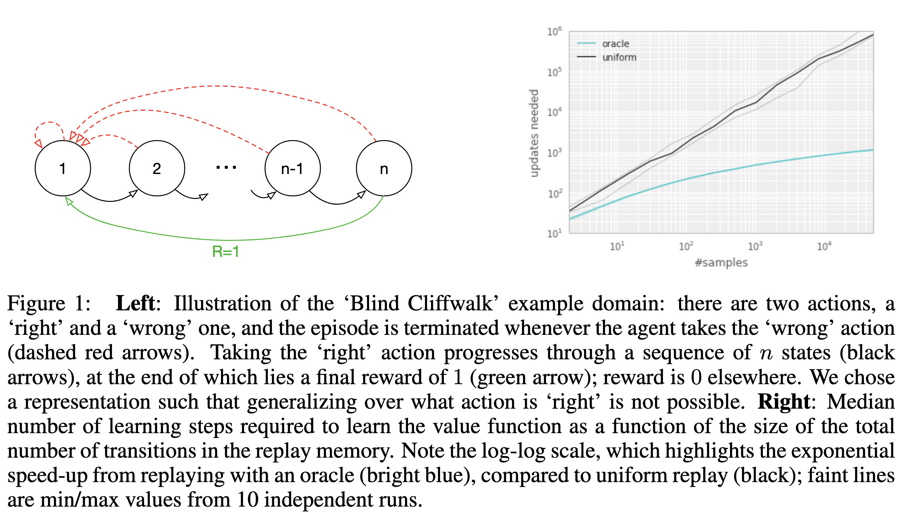
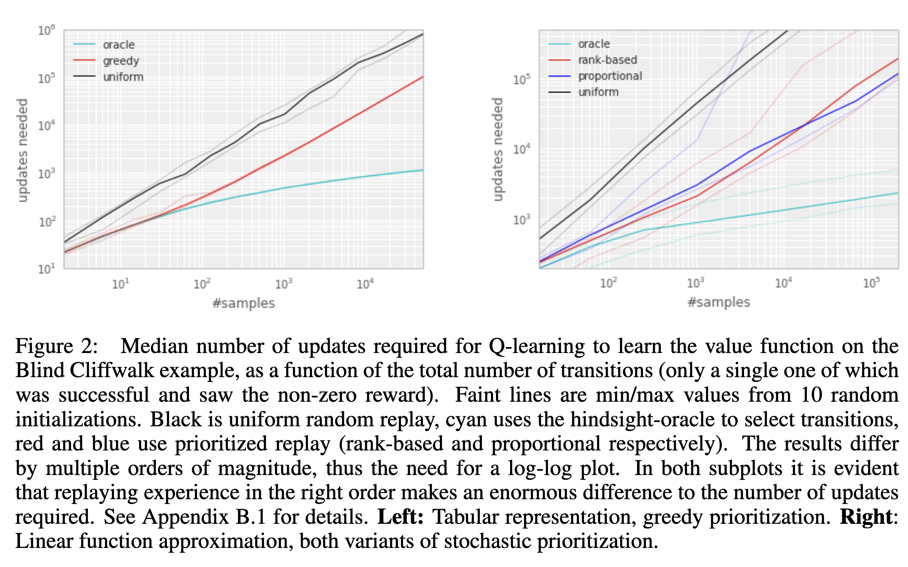
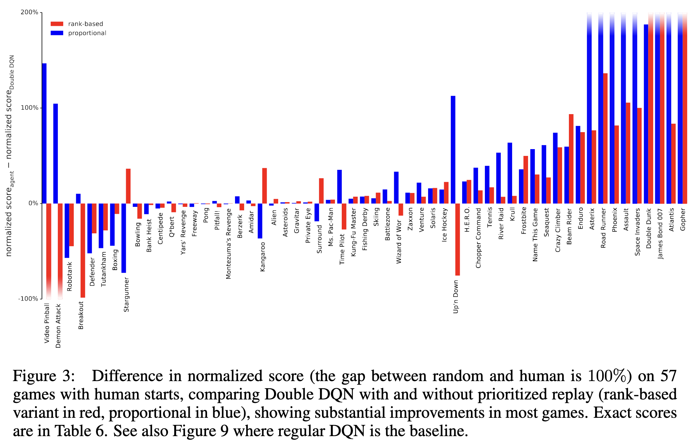
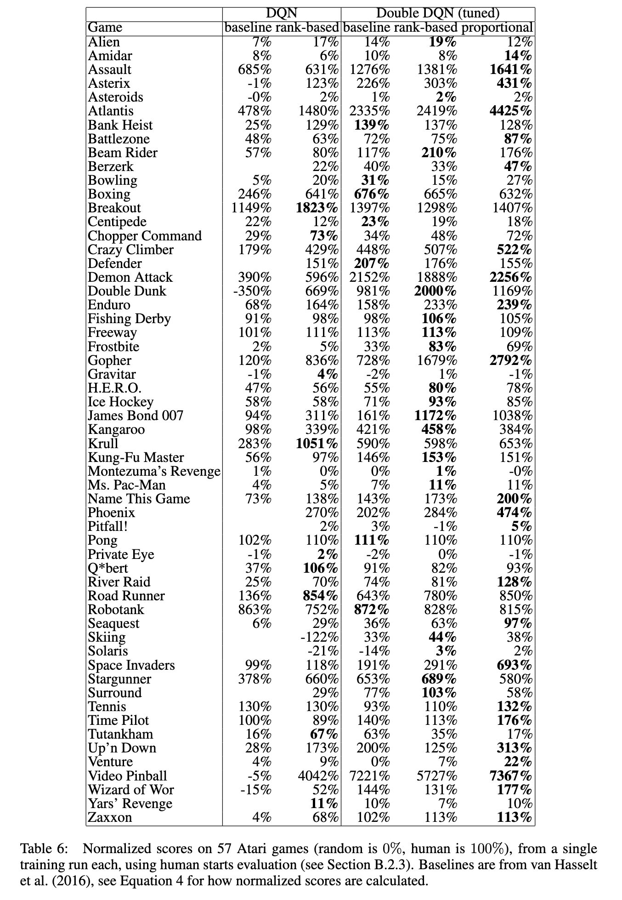
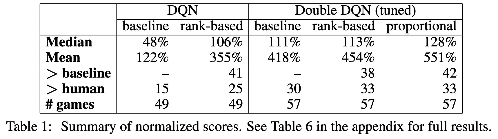
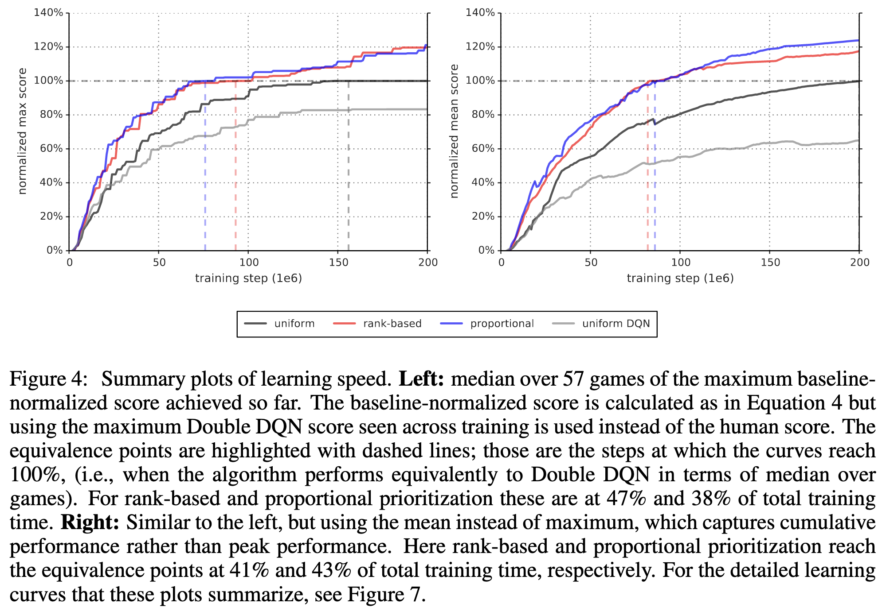
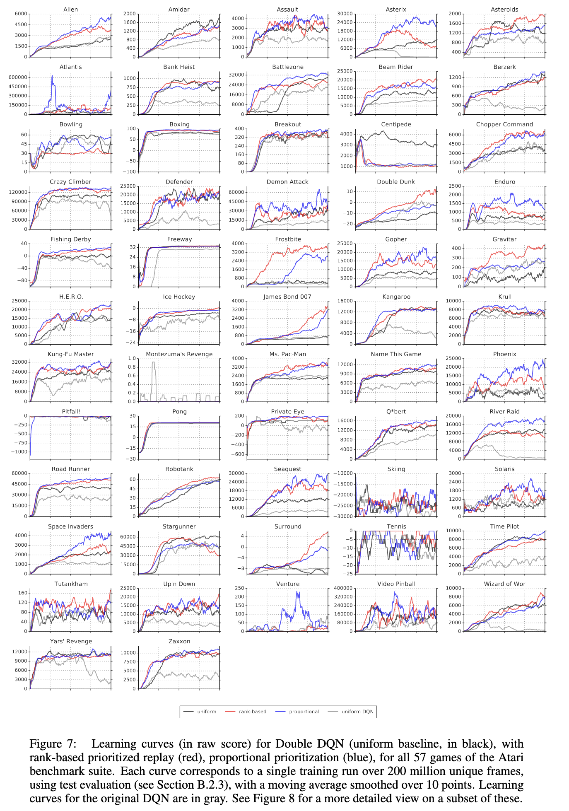
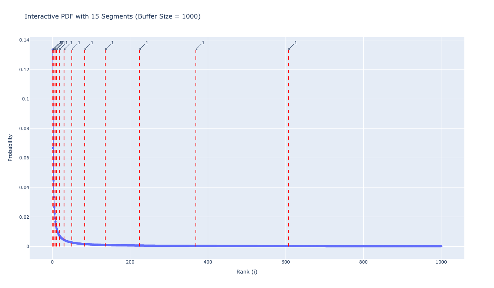
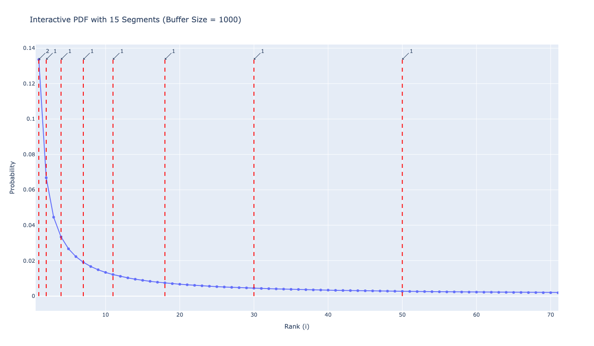
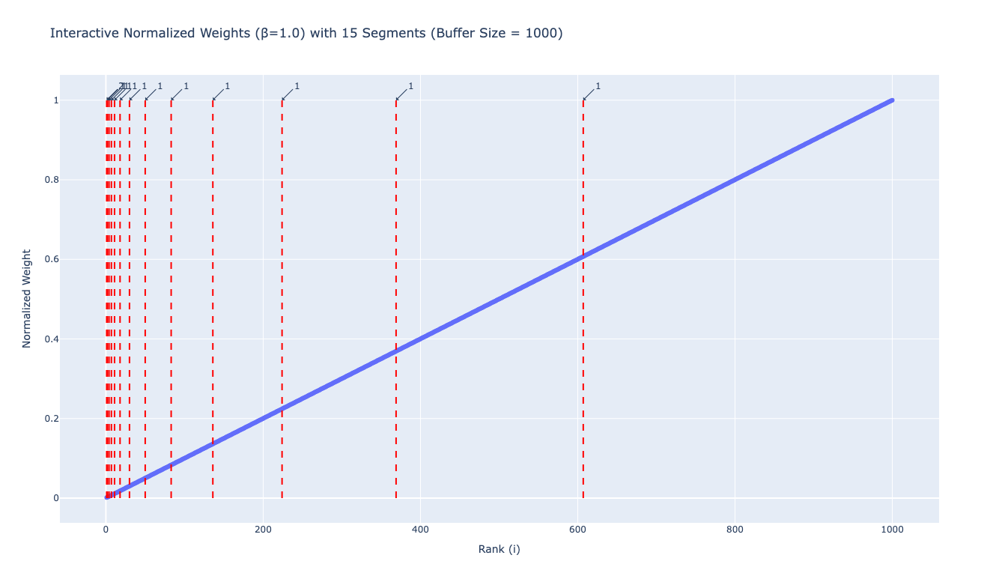

+++
date = '2025-03-26T14:27:41+09:00'
draft = false
title = 'Prioritized Experience Replay'
+++


# Introduction

In [DQN](/papers/dqn), samples are simply selected uniformly from replay buffer in regardless of their importance.
They argue that by using Priority Experience Replay (PER) better performance can be reached than using uniform sampling.

# Experiment
## Blind Cliffwarlk


<!-- Blind Cliffwalk environment explanation
: Taking the "right" action progresses through a sequence of $n$ states (black arrows), at the end of which lies a final reward of $1$ (green arrow). Otherwise, reward is 0 and the episode is terminated and go back to initial state -->

> Blind Cliffwalk environment explanation
- Taking the "right" action progresses through a sequence of $n$ states (black arrows), at the end of which lies a final reward of $1$ (green arrow). 
- Otherwise, reward is 0 and the episode is terminated and go back to initial state

The figure above illustrates how difficulty it is to reach a state when it is very rare.

In this example, $2^n$ attempts are expected to get positive reward. In other words, expected probability of reaching rightmost state is $2^{-n}$. With random policy, approximately $2^n$ actions are required to reach the positive reward and even if that transition is saved in replay buffer, the probability of sampling it is for that is $2^{-n}$, which is significantly low.

In figure, black line in right chart illustrates how long it takes to train with uniformly sampled transitions. In contrast, the cyan line, which represents learning speed with _oracle_ sampling method, significantly outperforms black line. Note that the chart is plotted on a log-log scale.

### Oracle Sampling
The better the transition sample, the more likely it is to cause a significant reduction in TD error for all sample. _Oracle_ uses ideal sampling strategy that maximizes the decreasing of TD-errors for every samples.

Let the $k$-th sample be denoted as $d_k= \(s_k, a_k, r_k, s^\prime_{k}\)$ and parameters after $i$ times update as $\theta_i$ and model as $Q_{\theta_{i}}$. We can calculate global loss with respect to $\theta_i$ as $$L_i = \frac{1}{n} \sum_{k=1}^n \[r_k + \gamma \max_{a'} Q_{\theta_i}(s^\prime_k, a^\prime) - Q_{\theta_i} (s_k, a_k) \]^2$$ _Oracle_ samples the transition that leads to the greatest reduction in global loss, i.e., greedly select index $k$, that maximizes the decrease in loss, $\arg \max_{k} L_{i} - L_{i+1}$.

### Proritizing
The important point in sampling strategy is how much model can learn from selected samples. One of criteria is TD error, which indicates difference from value of current state and action to its next-step bootstrap estimate.

To demonstrate the potential effectiveness of prioritizing replay by TD error, "_greedy TD-error prioritization_" is compared with uniform and oracle strategy. In this strategy, TD error is calculated and stored when transition is selected from replay buffer. And when a new transition arrives, it is assigned the maximum priority so that it is guaranteed to be seen at least once. It is important to initialize the network parameters with non-zero values otherwise TD error of transition with zero reward would be calculated as zero and might never be sampled.



Left chart of above figure shows performance of _greedy TD-error prioritizaiton_ compared to Uniform and Oracle in Blind Cliffwalk environment. It shows substantial reduction in the effort required to solve the Blind Cliffwalk task.


# Methods
## Stochastic Prioritization

One of the drawbacks of greedy TD-error prioritization is that some transitions with much lower TD errors may never be replayed.

_Stochastic Prioritization_ is designed to interpolate between pure greedy prioritization and uniform random sampling. It ensures that the sampling probability increases monotonically with a transition’s priority, while also guaranteeing a non-zero probability even for transitions with the lowest priority.

Below _stochastic prioritization_ methods satisfies the conditions mentioned above.

$$ P(i) = \frac{p_i^\alpha}{\sum_k p_k^\alpha}$$

- $P(i)$ represents the probability that $i$-th transition will be sampled.
- $\alpha$ is the exponent term. $\alpha = 0$ means uniform sampling method.
- $p_i > 0$ is the priority of transition $i$. There are two ways to define of seletion $p_i$.
- Direct method: $p_i = |\delta_i| + \epsilon$, which is direct, proportional prioritzation
- Indirect method: $p_i = \frac{1}{\text{rank}(i)}$
  - $\text{rank}(i) :=$ rank of transition $i$ within replay memory that is sorted according to $|\delta_i|$ by descending order.

In the right plot of the figure, the red line (rank-based) shows the performance of the second method, while the blue line (proportional) shows the performance of the first method. The plot indicates that the rank-based method is more robust than the proportional one.


## Importance Sampling

> The estimation of the expected value with stochastic updates relies on those updates corresponding to the same distribution as its expectation. Prioritized replay introduces bias because it changes this distribution in an uncontrolled fashion.

This is why importance sampling is necessary.
<!-- $$ L = \mathbb{E}_\pi [r + \gamma \max Q(s^\prime, a^\prime )  - Q(s,a)] $$ -->
In original Q Learning, $(s, a)$ pairs are sampled by the distribution of $\pi$.  
In uniform random sampling methods, sampling probability for $s,a$ is matched with policy $\pi$. 
But in prioritized experience replay sampling methods, sampled distribution of $s,a$ differs from one from policy $\pi$. 
So we need to adjust it.

$$ w_i = \left(\frac{1}{N} \cdot \frac{1}{P(i)}\right)^\beta $$

$w_i$ is multiplied by P(i) and this process is called **weighted importance sampling**.
If $\beta = 1$, $w_i$ fully compensates for the non-uniform probabilities $P(i)$.
These weights are adjusted when updating network parameters like this, $w_i \delta_i$, not just updated only with $\delta_i$.
For stability reason, $w_i$ is normalized by multiplying $1/\max_i w_i$, which scales down the update magnitude.

In Deep Q learning, due to changing policy, learning process is highly non-stationary.
So $\beta$ is linearly increased from $\beta_0$ to $1$ during training.

# Experiment Result
## Performance

Hyperparameter $\alpha, \beta$ for PER methods for atari games are chosen by coarse grid search. 
This grid search is evaluated on a subset of 8 games.
For rank-based, sweet spot is $\alpha = 0.7, \beta_0 = 0.5$ and for proportional, sweet spot is $\alpha = 0.6, \beta_0 = 0.4$.



The figure above shows the performance of each algorithms. Each DQN and Double DQN algorithm is processed combined with uniform sampling(baseline), rank-based, or proportional sampling methods.


And this figure summarizes results of above one.
Those indicatest that PER improves performances in general cases.
By adding PER to DQN, substantial improvement occurs in score on $41$ out of $49$ games, with the median normalized performance across $49$ games increasing from $48$% to $106$%.

 
## Learning Speed

Figure 4 illustrateds the learning speed of each methods; uniform, rank-based, proportional, and uniform DQN. 
Uniform, which is displayed by black line, indicates performance of Double DQN with uniform sampling.
Rank-based and proportional represents the performance of Double DQN using rank-based and proportional prioritization sampling methods, respectively.
Figure 4 shows that each rank-based and proportional methods outperforms original Double DQN method, in which learned more quickly.


Figure 7 compares the performance of each method across individual games.


# Supplymentary Explanation
## Visual Explanation of Rank-Based Method
### Propbability in Rank-based Approach
Approximate the cumulative distribution function (CDF) with a piecewise linear function consisting of k segments, each covering an equal probability mass.
At runtime, a segment is first sampled, and then a transition is uniformly sampled within that segment.
Typically, k is chosen to be the same as the batch size.


The figure above shows the probability distribution function of the rank-based method when the number of transitions is 1000 and the number of segments $k$ is 15. The red dotted lines represent the boundaries between segments.


This figure is a zoomed-in view of the previous one. Looking at the first red dotted line, you can see the number “2” annotated, indicating that the leftmost sample is included in two different segments and will therefore be sampled twice.


```python
import numpy as np
import plotly.graph_objects as go
from collections import Counter


class rank_based_simulate:
    def __init__(self, size):
        self.size = size
        self.buffer = []
        self.total = 0.0
        for i in range(1, size + 1):
            self.buffer.append(1 / i)
            self.total += 1 / i
        self.probs = [p / self.total for p in self.buffer]
        self.cum_probs = np.cumsum(self.probs)


def plot_pdf_segments_plotly_with_grouping(buffer_size, num_segments, x_range=None):
    per = rank_based_simulate(buffer_size)
    ranks = np.arange(1, buffer_size + 1)

    fig = go.Figure()
    fig.add_trace(
        go.Scatter(
            x=ranks, 
            y=per.probs, 
            mode="lines+markers", 
            name="Probability (PDF)",
        )
    )

    boundaries = []
    for seg in range(1, num_segments):
        target = seg / num_segments
        idx = np.searchsorted(per.cum_probs, target)
        boundaries.append(idx + 1)

    boundary_counts = Counter(boundaries)
    unique_boundaries = sorted(boundary_counts.keys())

    for b in unique_boundaries:
        count = boundary_counts[b]
        fig.add_shape(
            type="line",
            x0=b,
            y0=0,
            x1=b,
            y1=max(per.probs),
            line=dict(color="red", dash="dash"),
        )
        annotation_text = f"{count}"
        fig.add_annotation(
            x=b,
            y=max(per.probs),
            text=annotation_text,
            showarrow=True,
            arrowhead=1,
            ax=20,
            ay=-20,
        )

    fig.update_layout(
        title=f"Interactive PDF with {num_segments} Segments (Buffer Size = {buffer_size})",
        xaxis_title="Rank (i)",
        yaxis_title="Probability",
        hovermode="closest",
    )

    if x_range is not None:
        fig.update_xaxes(range=x_range)

    fig.show()


plot_pdf_segments_plotly_with_grouping(1000, 15)

```
This code snippet is used to make above two figures.

### Weighted Importance Sampling Values in Rank-based Approach
Also, I visualize $w_i$ corresponding to $P(i)$ in rank-based sampling methods when $\beta =1$.

The figure above shows $w_i$ values corresponding with each $P(i)$, which increases linearly.

```python
import numpy as np
import plotly.graph_objects as go
from collections import Counter


class PER_simulate:
    def __init__(self, size):
        self.size = size
        self.buffer = []
        self.total = 0.0
        for i in range(1, size + 1):
            self.buffer.append(1 / i)
            self.total += 1 / i
        self.probs = np.array(self.buffer) / self.total
        self.cum_probs = np.cumsum(self.probs)


def compute_normalized_weights(P, beta, N):
    raw = (1 / (N * P)) ** beta
    return raw / np.max(raw)


def plot_normalized_weights_plotly_with_grouping(
    buffer_size, num_segments, beta=1.0, x_range=None
):
    per = PER_simulate(buffer_size)
    ranks = np.arange(1, buffer_size + 1)
    N = buffer_size

    norm_weights = compute_normalized_weights(per.probs, beta, N)

    fig = go.Figure()
    fig.add_trace(
        go.Scatter(
            x=ranks, y=norm_weights, mode="lines+markers", name="Normalized Weights"
        )
    )

    boundaries = []
    for seg in range(1, num_segments):
        target = seg / num_segments
        idx = np.searchsorted(per.cum_probs, target)
        boundaries.append(idx + 1)

    boundary_counts = Counter(boundaries)
    unique_boundaries = sorted(boundary_counts.keys())

    for b in unique_boundaries:
        count = boundary_counts[b]
        fig.add_shape(
            type="line",
            x0=b,
            y0=0,
            x1=b,
            y1=max(norm_weights),
            line=dict(color="red", dash="dash"),
        )
        annotation_text = f"{count}"
        fig.add_annotation(
            x=b,
            y=max(norm_weights),
            text=annotation_text,
            showarrow=True,
            arrowhead=1,
            ax=20,
            ay=-20,
        )

    fig.update_layout(
        title=f"Interactive Normalized Weights (β={beta}) with {num_segments} Segments\n(Buffer Size = {buffer_size})",
        xaxis_title="Rank (i)",
        yaxis_title="Normalized Weight",
        hovermode="closest",
    )

    if x_range is not None:
        fig.update_xaxes(range=x_range)

    fig.show()


plot_normalized_weights_plotly_with_grouping(1000, 15, beta=1.0)

```

Above code snippet is used to visualize $w_i$ values.